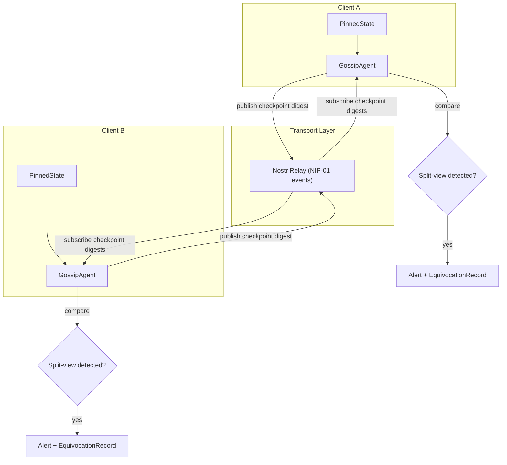
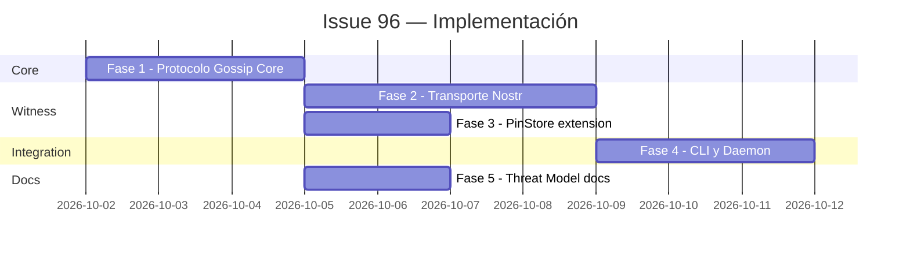

# Plan de Implementación — Issue #96
## Checkpoint Gossip Protocol for Global Split-View Detection

> **Repositorio**: `satspath/satspath`
> **Issue**: [#96 — \[IMPORTANT\] I7: Checkpoint gossip protocol for global split-view detection](https://github.com/satspath/satspath/issues/96)
> **Entrega**: Este trabajo se debe subir mediante un **Pull Request** apuntando a `main` en `satspath/satspath`, con la branch `feat/gossip-split-view-detection`.

---

## 1. Contexto y Problema

El checkpoint pinning actual es **local-only**. El `WitnessService` en [`satspath-witness`](file:///home/chelo/antigravity/PlanB/satspath/crates/satspath-witness/src/lib.rs) detecta:
- **Rollback**: el operador reduce `tree_size` (L302-L307)
- **Equivocación local**: misma `tree_size` con diferente `root_hash` (L310-L331)
- **Avance inválido**: `consistency_proof` falla (L334-L351)

Y el módulo [`replication.rs`](file:///home/chelo/antigravity/PlanB/satspath/crates/satspath-core/src/transparency/replication.rs) provee `detect_equivocation()` y `validate_no_rollback()` para réplicas.

**Lo que falta**: un cliente no puede detectar si el operador sirve una **vista diferente a otro cliente** (split-view attack). Del threat model en [`key_transparency.md`](file:///home/chelo/antigravity/PlanB/satspath/docs/key_transparency.md):

> *"A malicious operator can attempt split views; client pinning and K-of-N witness quorums detect rollback and equivocation, while real-time decentralized gossip remains future work."*

---

## 2. Arquitectura Propuesta



### Decisiones de Diseño Clave

| Decisión | Elección | Justificación |
|----------|----------|---------------|
| **Transporte** | Nostr relays (NIP-01) | Ya integrado en el proyecto ([`resolvers/nostr.rs`](file:///home/chelo/antigravity/PlanB/satspath/crates/satspath-core/src/resolvers/nostr.rs), `tokio-tungstenite` en deps). Sin infraestructura nueva. |
| **Formato de mensaje** | `GossipCheckpointDigest` (struct firmado) | Reutiliza el esquema de firma BIP-340 existente en `satspath-core::crypto` |
| **Comparación** | Contra `PinnedState` local existente | Extiende el `PinStore` trait del witness crate |
| **Anti-Sybil** | Quorum de verificadores conocidos | Extiende `WitnessQuorumPolicy` existente |

---

## 3. Fases de Implementación

### Fase 1: Protocolo Gossip Core (`satspath-core`)

**Archivos a crear/modificar:**
- `crates/satspath-core/src/transparency/gossip.rs` *(nuevo)*
- `crates/satspath-core/src/transparency/mod.rs` *(modificar — agregar módulo)*

**Estructuras de datos:**

```rust
/// Mensaje gossip firmado que un cliente publica con su checkpoint observado.
#[derive(Debug, Clone, Serialize, Deserialize)]
pub struct GossipCheckpointDigest {
    pub version: u16,                    // 1
    pub log_id: String,                  // ID del log de transparencia
    pub tree_size: u64,                  // Tamaño del árbol observado
    pub root_hash: String,               // Raíz Merkle observada
    pub checkpoint_hash: String,         // Hash del checkpoint firmado
    pub observer_pubkey: String,         // Clave pública del observador
    pub observed_at: i64,                // Timestamp de observación
    pub signature: String,               // Firma BIP-340 sobre el mensaje
}

/// Resultado de comparación gossip
#[derive(Debug, Clone, Serialize, Deserialize)]
pub enum GossipComparisonResult {
    /// Los checkpoints coinciden
    Consistent,
    /// El peer tiene un árbol más avanzado (no es split-view, solo es más reciente)
    PeerAhead { peer_tree_size: u64, local_tree_size: u64 },
    /// Split-view detectado: mismo tree_size, diferente root
    SplitViewDetected {
        log_id: String,
        tree_size: u64,
        local_root: String,
        peer_root: String,
        peer_pubkey: String,
    },
}

/// Alerta de split-view con evidencia criptográfica
#[derive(Debug, Clone, Serialize, Deserialize)]
pub struct SplitViewAlert {
    pub log_id: String,
    pub tree_size: u64,
    pub local_digest: GossipCheckpointDigest,
    pub conflicting_digest: GossipCheckpointDigest,
    pub detected_at: i64,
}
```

**Funciones:**
- `fn gossip_digest_signing_message(digest: &GossipCheckpointDigest) -> String` — mensaje canónico con domain separation `SatsPathGossipV1\n...`
- `fn create_gossip_digest(pinned: &PinnedState, keypair: &IdentityKeypair) -> GossipCheckpointDigest`
- `fn verify_gossip_digest(digest: &GossipCheckpointDigest) -> Result<bool>` — verifica firma BIP-340
- `fn compare_gossip_digest(local: &PinnedState, remote: &GossipCheckpointDigest) -> GossipComparisonResult`

**Tests unitarios:**
- Creación y verificación de digest firmado
- Comparación consistente (mismo checkpoint)
- Detección de split-view (mismo `tree_size`, diferente `root_hash`)
- Rechazo de digest con firma inválida/tampered
- Caso de peer más avanzado (no es split-view)

---

### Fase 2: Transporte Nostr (`satspath-witness`)

**Archivos a crear/modificar:**
- `crates/satspath-witness/src/gossip.rs` *(nuevo)*
- `crates/satspath-witness/src/lib.rs` *(modificar — re-export)*

**Componentes:**

```rust
/// Configuración del gossip agent
pub struct GossipConfig {
    pub relay_urls: Vec<String>,           // URLs de relays Nostr
    pub log_id: String,                    // Log a monitorear
    pub publish_interval_secs: u64,        // Frecuencia de publicación
    pub known_observer_pubkeys: HashSet<String>,  // Anti-Sybil: observers confiables
    pub min_observers_for_alert: u8,       // Umbral mínimo para considerar alerta válida
}

/// GossipAgent — publica y consume checkpoint digests via Nostr
pub struct GossipAgent<S: PinStore> {
    config: GossipConfig,
    store: S,
    keypair: IdentityKeypair,
    alert_sink: Box<dyn AlertSink>,
}

#[async_trait]
pub trait AlertSink: Send + Sync {
    async fn on_split_view(&self, alert: SplitViewAlert) -> Result<(), WitnessError>;
}
```

**Protocolo Nostr:**
- **Kind**: NIP-01 custom kind (ej. `kind: 30_078` o un kind específico como `kind: 21_096`)
- **Tag `d`**: `satspath-gossip:{log_id}` para indexación
- **Content**: JSON serializado de `GossipCheckpointDigest`
- **Filtro de subscripción**: `{"kinds": [21096], "#d": ["satspath-gossip:{log_id}"]}`

**Flujo:**
1. `GossipAgent::start()` inicia loop de publicación periódica + subscripción
2. Al recibir un digest remoto:
   - Verificar firma BIP-340
   - Verificar que `observer_pubkey` está en `known_observer_pubkeys`
   - `compare_gossip_digest()` contra el `PinnedState` local
   - Si `SplitViewDetected` → llamar `alert_sink.on_split_view()` + guardar en `PinStore`

**Tests:**
- Roundtrip: publicar → serializar → deserializar → verificar
- Filtrado de observers no autorizados (anti-Sybil)
- Mock relay para test de integración

---

### Fase 3: Almacenamiento de Alertas (`PinStore` extension)

**Archivos a modificar:**
- `crates/satspath-witness/src/lib.rs` — extender `PinStore` trait

**Cambios al trait:**

```rust
#[async_trait]
pub trait PinStore: Send + Sync {
    // ... métodos existentes ...
    
    // Nuevos métodos para gossip
    async fn record_split_view(
        &self,
        alert: SplitViewAlert,
    ) -> Result<(), WitnessError>;
    
    async fn get_split_views(
        &self,
        log_id: &str,
    ) -> Result<Vec<SplitViewAlert>, WitnessError>;
}
```

Implementar en `MemoryPinStore` y `FilePinStore`.

---

### Fase 4: Integración con CLI y Daemon

**Archivos a crear/modificar:**
- `crates/satspath-cli/src/commands/gossip.rs` *(nuevo)* — subcomandos:
  - `satspath gossip start --relay wss://... --log-id <ID>` — inicia agent
  - `satspath gossip status` — muestra estado de gossip y alertas
  - `satspath gossip alerts` — lista split-view alerts detectados
- `crates/satspathd/src/handlers/gossip.rs` *(nuevo)* — endpoints API:
  - `GET /v1/gossip/status` — estado del gossip agent
  - `GET /v1/gossip/alerts` — alertas de split-view

---

### Fase 5: Documentación del Threat Model

**Archivos a crear/modificar:**
- `docs/gossip_threat_model.md` *(nuevo)*

**Contenido requerido:**

| Amenaza | Descripción | Mitigación |
|---------|-------------|------------|
| **Sybil attack** | Atacante crea múltiples observers falsos | `known_observer_pubkeys` whitelist + `min_observers_for_alert` umbral |
| **Eclipse attack** | Atacante controla todos los relays del cliente | Configuración multi-relay, Nostr relay diversity |
| **Gossip poisoning** | Digests con firmas válidas pero datos falsos | Verificación BIP-340 + cross-reference con pinned state |
| **Replay attack** | Re-publicación de digests antiguos | Verificación de `observed_at` timestamp freshness window |
| **Relay censorship** | Relay filtra/bloquea mensajes gossip | Multi-relay fanout, fallback a HTTP polling entre witnesses |

También actualizar la sección "Threats and limitations" de [`docs/key_transparency.md`](file:///home/chelo/antigravity/PlanB/satspath/docs/key_transparency.md) para reflejar que gossip ya no es "future work".

---

## 4. Dependencias y Orden de Ejecución



**Dependencias de crates Rust (nuevas):**
- Ninguna nueva requerida. El proyecto ya tiene:
  - `tokio-tungstenite` para WebSocket (Nostr relay transport)
  - `secp256k1` para firmas BIP-340
  - `serde`/`serde_json` para serialización
  - `chrono` para timestamps

---

## 5. Criterios de Aceptación

- [ ] `GossipCheckpointDigest` se puede crear, firmar y verificar con BIP-340
- [ ] `compare_gossip_digest()` detecta correctamente split-views
- [ ] `GossipAgent` publica digests a Nostr relays y consume los de otros observers
- [ ] Observers no autorizados son filtrados (anti-Sybil)
- [ ] `SplitViewAlert` se persiste en `PinStore` (memoria y disco)
- [ ] CLI `satspath gossip alerts` muestra alertas activas
- [ ] Daemon expone `/v1/gossip/alerts` endpoint
- [ ] `docs/gossip_threat_model.md` documenta amenazas y mitigaciones
- [ ] `docs/key_transparency.md` actualizado — gossip ya no es "future work"
- [ ] Tests unitarios para todas las fases (mínimo 90% coverage en módulos nuevos)
- [ ] Tests de integración con mock Nostr relay

---

## 6. Entrega

> [!IMPORTANT]
> Este issue se debe subir mediante un **Pull Request** con branch `feat/gossip-split-view-detection` apuntando a `main` en `satspath/satspath`.
>
> El PR debe:
> - Referenciar `Closes #96` en el body
> - Incluir los tests unitarios y de integración
> - Pasar CI (`cargo test`, `cargo clippy`, `cargo fmt --check`)
> - Incluir la documentación del threat model

---

## 7. Archivos del Proyecto Relevantes (Referencia)

| Archivo | Rol |
|---------|-----|
| [`lib.rs`](file:///home/chelo/antigravity/PlanB/satspath/crates/satspath-witness/src/lib.rs) | WitnessService, PinStore trait, quorum policy |
| [`verifier.rs`](file:///home/chelo/antigravity/PlanB/satspath/crates/satspath-core/src/transparency/verifier.rs) | Verificación de checkpoints, consistency proofs |
| [`replication.rs`](file:///home/chelo/antigravity/PlanB/satspath/crates/satspath-core/src/transparency/replication.rs) | `detect_equivocation()`, `validate_no_rollback()` |
| [`protocol.rs`](file:///home/chelo/antigravity/PlanB/satspath/crates/satspath-core/src/transparency/protocol.rs) | `WitnessCosignature`, `NamespaceDescriptor`, `ResolutionEnvelope` |
| [`resolver.rs`](file:///home/chelo/antigravity/PlanB/satspath/crates/satspath-core/src/transparency/resolver.rs) | Quorum verification en resolución |
| [`mod.rs`](file:///home/chelo/antigravity/PlanB/satspath/crates/satspath-core/src/transparency/mod.rs) | Re-exports del módulo de transparencia |
| [`nostr.rs`](file:///home/chelo/antigravity/PlanB/satspath/crates/satspath-core/src/resolvers/nostr.rs) | Integración Nostr existente |
| [`key_transparency.md`](file:///home/chelo/antigravity/PlanB/satspath/docs/key_transparency.md) | Threat model actual |
